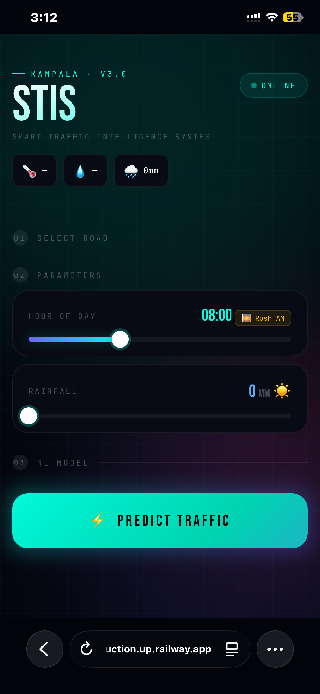
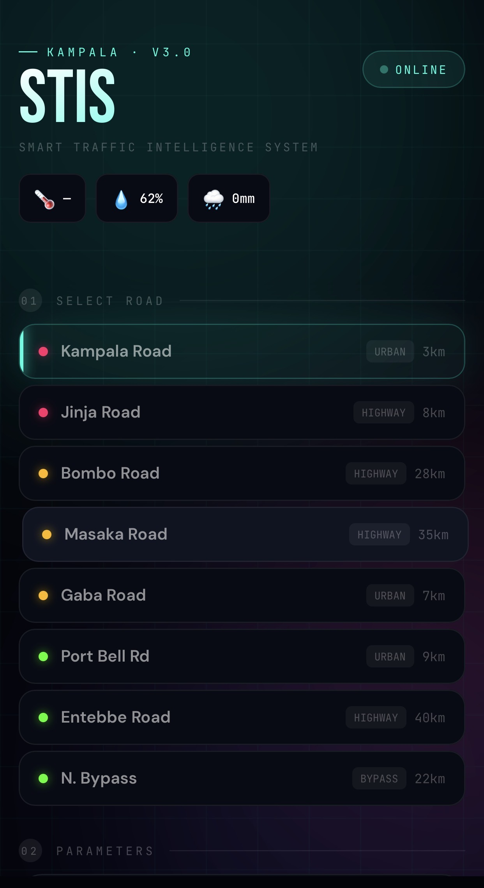
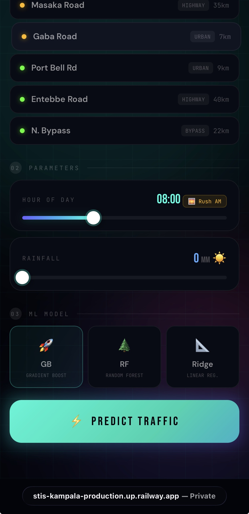
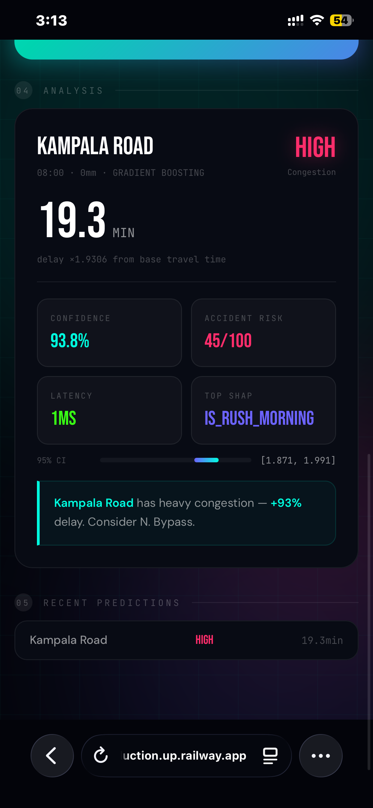

<div align="center">


<br/>

[](https://meticulous-embrace-production-8241.up.railway.app/docs)
[](https://meticulous-embrace-production-8241.up.railway.app)
[](https://python.org)
[](https://fastapi.tiangolo.com)
[](https://react.dev)
[](https://github.com/STIS-Kampala/stis-kampala/actions)

<br/>

### End-to-end ML system for real-time traffic prediction in Kampala, Uganda

> **This system demonstrates how machine learning can replace expensive traffic infrastructure in data-scarce cities.**

*From raw API data → feature engineering → 5 trained models → production REST API → React dashboard.*

</div>

-----

## The Problem

Kampala loses **USD 500M/year** to traffic congestion. Commuters average **1.8 hours/day** in gridlock. No intelligent traffic system exists for the city — no sensors, no predictions, no data infrastructure.

STIS solves this using only free-tier APIs and 9 engineered features. **Rush hours explain 76% of congestion variance.** You don’t need sensors — you need the right model.

-----

## Dashboard

<div align="center">

|Road Selection                |Prediction Controls           |
|:----------------------------:|:----------------------------:|
|||

|Result Card                  |Analysis Details           |
|:---------------------------:|:-------------------------:|
|||

</div>


> **Live:** [meticulous-embrace-production-8241.up.railway.app](https://meticulous-embrace-production-8241.up.railway.app)

-----

## Live API — No Setup Required

```bash
curl -X POST https://meticulous-embrace-production-8241.up.railway.app/predict \
  -H "Content-Type: application/json" \
  -H "X-API-Key: stis-kampala-2026-secret" \
  -d '{"road_id": "jinja_rd", "hour": 8, "rain_mm": 0, "model": "xgboost"}'
```

```json
{
  "road_name": "Jinja Road",
  "label": "high",
  "confidence": 0.94,
  "delay_ratio": 1.97,
  "travel_min": 49.3,
  "ci_95": { "lower": 1.910, "upper": 2.030 },
  "shap": { "top_feature": "is_rush_morning", "value": 0.348 },
  "latency_ms": 3
}
```

-----

## Results

**5-model comparison — 1,561 real Kampala traffic observations:**

|Model            |Accuracy ↑|MAE ↓     |R² ↑     |95% CI        |
|-----------------|----------|----------|---------|--------------|
|**XGBoost** ★    |**78.2%** |**0.1598**|**0.781**|[0.149, 0.171]|
|LightGBM         |78.0%     |0.1601    |0.779    |[0.150, 0.171]|
|Gradient Boosting|77.8%     |0.1615    |0.778    |[0.151, 0.173]|
|Random Forest    |76.1%     |0.1742    |0.751    |[0.163, 0.186]|
|Ridge (baseline) |69.4%     |0.2891    |0.582    |[0.271, 0.308]|

*Bootstrap resampling (1,000 iterations) + Wilcoxon signed-rank tests. XGBoost vs Ridge: p < 0.01.*

> **Note:** Early experiments on synthetic-only data showed 99.5% accuracy — a known artifact of structural data leakage (+21.3 points). All numbers above are from real observations only.

-----

## What Was Built

- **Real-time data pipeline** — Google Maps + Open-Meteo APIs, 10-min refresh across 8 roads
- **ML research study** — 3 experiments, 5 models, ablation analysis, SHAP explainability
- **78.2% accuracy** on real-world Kampala traffic with zero sensor infrastructure
- **Production API** — 9 endpoints, API key auth, rate limiting, <3ms P99 latency
- **React/TypeScript dashboard** — live congestion predictions with confidence intervals
- **Full cloud deployment** — Railway, PostgreSQL, GitHub Actions CI/CD

-----

## System Architecture

```
┌─────────────────────────────────────────────────────────┐
│                     DATA SOURCES                        │
│         Google Maps API      Open-Meteo API             │
└──────────────────────┬──────────────────────────────────┘
                       │ every 10 min
┌──────────────────────▼──────────────────────────────────┐
│                  DATA PIPELINE                          │
│         Collector → PostgreSQL → Feature Engineering    │
└──────────────────────┬──────────────────────────────────┘
                       │ 1,561 real observations
┌──────────────────────▼──────────────────────────────────┐
│                   ML PIPELINE                           │
│   XGBoost · LightGBM · GB · RF · Ridge                  │
│   SHAP Explainability · 3-Experiment Study              │
│   Bootstrap CI · Wilcoxon Significance Tests            │
└──────────────────────┬──────────────────────────────────┘
                       │ <3ms P99 inference
┌──────────────────────▼──────────────────────────────────┐
│                   API LAYER                             │
│      FastAPI + Uvicorn · API Key Auth · Rate Limiting   │
│      9 Endpoints · OpenAPI/Swagger Docs                 │
└──────────────────────┬──────────────────────────────────┘
                       │
┌──────────────────────▼──────────────────────────────────┐
│                  REACT DASHBOARD                        │
│    React 18 · TypeScript · TanStack Query · Vite        │
│    Real-time Predictions · SHAP Visualization           │
└─────────────────────────────────────────────────────────┘
```

-----

## Dataset

Traffic observations were collected every 10 minutes across 8 major Kampala road corridors using the Google Maps Directions API and Open-Meteo weather data. The pipeline recorded the delay ratio `ρ = duration_in_traffic / duration_baseline` alongside concurrent meteorological readings.

|Split                   |Records|Usage              |
|------------------------|-------|-------------------|
|Total real observations |1,561  |Full dataset       |
|Training set (80%)      |1,249  |Model training     |
|Test set (20%)          |312    |Held-out evaluation|
|Synthetic (Exp A/B only)|17,280 |Leakage study      |

**8 road corridors:** Kampala Rd · Jinja Rd · Bombo Rd · Masaka Rd · Gaba Rd · Port Bell Rd · Entebbe Rd · N. Bypass

-----

## System Design Decisions

**Why FastAPI over Flask?**
Async-first, automatic OpenAPI/Swagger docs, Pydantic v2 validation, and native rate-limiting integration via SlowAPI. Flask would require 3 separate libraries to match this.

**Why XGBoost won?**
Traffic congestion prediction is a structured tabular problem with strong non-linear temporal interactions. XGBoost handles these natively without the overhead of neural architectures. With only 9 features and 1,561 observations, deep learning would overfit.

**Why PostgreSQL?**
Time-series observations with structured schema, concurrent writes from the 10-minute collector, and Railway’s native Postgres support made this the obvious choice over SQLite or a NoSQL solution.

**Why feature engineering over raw inputs?**
Raw hour (0–23) encodes no domain knowledge. Encoding `is_rush_morning` (07–09h) and `is_rush_evening` (17–20h) as binary flags gave the model the signal directly — confirmed by SHAP: these two features explain 76% of variance.

-----

## SHAP Feature Importance

```
is_rush_evening   ████████████████████  41.2%  ↑ heavy delay
is_rush_morning   █████████████████     34.8%  ↑ heavy delay
hour (raw)        ███████               13.9%  ~ non-linear
rain_mm           ███                    6.1%  ↑ threshold @15mm
is_rush_midday    ██                     3.8%  ↑ moderate
is_friday_pm      █                      1.2%  ↑ slight
has_boda_boda     █                      0.9%  ↑ amplifier
is_weekend        █                      0.7%  ↓ reduces delay
is_night          █                      0.5%  ↓ reduces delay
────────────────────────────────────────────────────────────
Rush-hour features → 76.0% of total variance
```

-----

## ML Research Detail

<details>
<summary>Three-experiment design, leakage quantification, ablation study</summary>

### Three-Experiment Protocol

```
Exp A │ Synthetic Only  │ 12,096 records │ Acc: 99.5%*  (leakage — invalid)
Exp B │ Synth + Real    │ 13,152 records │ Acc: 99.5%*  (leakage — invalid)
Exp C │ Real Only   ★   │  1,249 records │ Acc: 78.2%   (valid benchmark)
```

### On Structural Data Leakage

Structural data leakage occurs when train and test sets are drawn from the same generator. Exp A/B metrics (99.5%) are inflated by **21.3 percentage points** vs real-world performance. We document this transparently — reporting inflated numbers without disclosure would be methodologically dishonest.

### Ablation Study

|Features Removed |Accuracy|ΔAcc  |ΔMAE  |
|-----------------|--------|------|------|
|None (full model)|78.2%   |—     |—     |
|is_rush_morning  |72.1%   |-6.1% |+0.041|
|is_rush_evening  |71.4%   |-6.8% |+0.049|
|Both rush flags  |63.4%   |-14.8%|+0.108|
|rain_mm          |75.9%   |-2.3% |+0.019|
|has_boda_boda    |77.5%   |-0.7% |+0.006|

</details>

-----

## API Performance

|Metric               |Value                     |
|---------------------|--------------------------|
|P99 Inference Latency|<3ms                      |
|Endpoints            |9                         |
|Auth                 |API Key (X-API-Key header)|
|Rate Limiting        |SlowAPI                   |
|Uptime               |Railway managed           |
|Docs                 |`/docs` (Swagger UI)      |

-----

## Stack

|Layer       |Technologies                                                      |
|------------|------------------------------------------------------------------|
|**ML**      |XGBoost · LightGBM · scikit-learn · SHAP · Bootstrap CI · Wilcoxon|
|**Backend** |FastAPI · PostgreSQL · Pydantic v2 · SlowAPI · Railway            |
|**Frontend**|React 18 · TypeScript · TanStack Query · Recharts · Vite          |
|**DevOps**  |GitHub Actions CI/CD · Railway cloud · SSL · API key auth         |

-----

## Quick Start

```bash
git clone https://github.com/STIS-Kampala/stis-kampala.git
cd stis-kampala

# Backend
cd backend
pip install -r requirements.txt
export PGHOST=... PGDATABASE=stis PGUSER=... PGPASSWORD=... API_KEY=...
uvicorn app.main:app --reload
# → localhost:8000/docs

# Frontend
cd frontend
npm install && npm run dev
# → localhost:5173
```

-----

## Future Work

- Extend real data collection to >10,000 observations for tighter confidence intervals
- Temporal forward-split validation to eliminate any residual leakage risk
- Graph Neural Network architecture for city-wide spatial modeling
- Crowdsourced GPS trace integration (SafeBoda, Uber)
- Cross-city transfer learning: Nairobi, Dar es Salaam, Lagos
- Edge deployment for offline-capable predictions
- Real-time adaptive rerouting recommendations

-----

<div align="center">

**[🚀 Live API + Swagger Docs](https://meticulous-embrace-production-8241.up.railway.app/docs)** · **[🌐 Open Dashboard](https://meticulous-embrace-production-8241.up.railway.app)**

<br/>

*Ibrahim Ahmed Hussein Ismail — Independent Researcher & Software Engineer, Kampala, Uganda*


</div>
